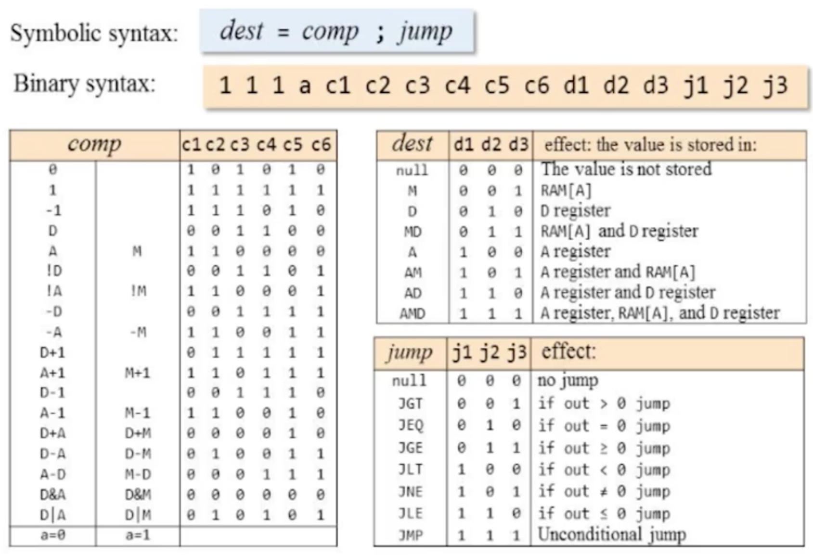

# C-Instructions Reference



## Hack Assembly Specification

Currently, assembly languages have become somewhat complex. However, we need basic concepts free of excessive abstraction. Therefore, according to the Nand2Tetris project, Hack Assembly is designed in a minimalistic form.

Hack Assembly instructions are divided into two types: **A (Address Mode)** and **C (Command Mode)**.

### **A-instruction**
- Represents either an address or a number in 15 bits.
  
### **C-instruction**
- Used for performing operations (e.g., addition, subtraction, data writing, etc.).

The distinction between A-instruction and C-instruction lies in the first bit of a 16-bit number:
- **0** for A-instruction.
- **1** for C-instruction. 

Thus, the remaining 15 bits are used to store the number in A-instruction.

**Maximum value representation of A-instruction:** `0111 1111 1111 1111`.

**Structure of a C-instruction:** `111 a c1,c2,c3,c4,c5,c6 d1,d2,d3 j1,j2,j3`.  
Although letters are used here for explanation, they are replaced with `0` or `1` in practice.

- **`a`** - Specifies the source of the ALU "y" operand during computation.
- **`c`** - Represents the computation (`comp`) operation.
- **`d`** - Indicates the destination (`dest`) register.
- **`j`** - Specifies the jump condition (`jump`).

You can observe this structure in the truth table shown above.

### Registers in Hack Assembly

Hack Assembly operates with three main registers: **D**, **A**, and **M**.

- **A**: Represents the value currently stored in the A register.
- **D**: Represents the value currently stored in the D register.
- **M**: Represents the value stored at the memory address specified by the A register (`M == RAM[A]`).

### A-instruction Usage
A-instructions are denoted using the `@` symbol.  
- Example: `@34` or via named variables like `@SP`.

### C-instruction Usage
C-instructions use the above structure to express operations, assignments (`D=A`), or jumps (`0;JMP`).

### Labels in Hack Assembly
Hack Assembly also supports **labels**, represented as `(LOOP)`.  
Labels are used to structure code and facilitate operations like loops. For instance:
- A label `(LOOP)` can be defined.
- By using `@LOOP` and `0;JMP`, operations can repeatedly execute until a condition is met.

[Hack assembly example](test.asm)

#lowlevel #asm

Virtual Machine (VM)  

Virtual Machine (VM) nima?

Agar siz Java dasturlash tili bilan tanish bo'lsangiz, **virtual mashina** (VM) atamasini eshitgan bo'lishingiz mumkin. Biz bu tushunchani soddaroq versiyasini ko'rib chiqamiz.  

**Virtual machine** – bu virtual mashina buyruqlari (bytecode) orqali amallarni bajaradigan maxsus dasturiy vosita. Hamda **stack** va **funksiyalarni** boshqarish imkoniyatini beradi.

Virtual Machine nima uchun kerak?

Hozirda kompyuterlar va boshqa qurilmalarda ishlatiladigan **uch xil asosiy protsessor turi** mavjud:  
- **x86**  
- **x64**  
- **ARM**  

Har bir protsessor o'zining unikal buyruqlar to'plamiga ega. High-level (yuqori darajadagi) dasturlash tillaridan bu protsessorlarning buyruqlariga to'g'ridan-to'g'ri o'girib chiqish murakkab va ko'p mehnat talab qiladi. Shuning uchun o'rtaga virtaul mashina qo'yiladi. Keyin bytecode'dan instruction'larga compile qilinadi.

Bu yondashuv orqali dasturlarni turli platformalarda qayta yozmasdan ishlatish mumkin bo'ladi. Masalan, Java dasturi bir marta yozilib, turli operatsion tizim va qurilmalarda ishlaydi.

Amallarni bajarish uchun xotira bo'laklarga (segmentlarga) bo'linadi. Segmentlar haqida batafsilroq ma'lumotni **Modern Assembly** mavzusida ko'rib chiqamiz. Hozir esa faqat **stack segmenti** haqida gaplashamiz.

**Stack** – bu xotiraning maxsus qismi bo'lib, unda ma'lumotlar **tartibli** saqlanadi. Bu haqida oldinroq [mana bu yerda](https://t.me/mahdiydev/121) gaplashganmiz.

**Stack** ikki asosiy amalni bajaradi:
1. **`push`** – stack'ga ma'lumot qo'shadi.
2. **`pop`** – stack'dan oxirgi qo'shilgan ma'lumotni olib tashlaydi.

Stack'da o'zgaruvchini saqlash **Modern Assembly**da sal murakkabroq ishlaydi. Biz hozircha oddiyroq versiyasi ko'ramiz. Stack'dagi o'zgaruchilarni saqlash uchun xotiradan local, argument, static, temp, internal lar uchun joy ajratamiz.

**VM** (virtual mashina) da bu amallar quyidagicha ishlaydi:
```
push constant 3   // 3-ni stack'ga qo'shadi.
pop local 0       // Stack'dan 3-ni olib, uni local 0'ga saqlaydi.
```

Virtual machina arifmetik amallarni ham qo'llab quvatlaydi. Arifmetik amallar quyidagilardan iborat:
- `add` - qo'shish
- `sub` - ayrish
- `and` - va
- `or`  - yoki
- `neg` - manfiyga o'zgartirish
- `not` - 0 bo'lsa 1 yoki 1 bo'lsa 0
- `eq`  - teng
- `gt`  - dan katta
- `lt`  - dan kichik

Funksiya:
```
function add 0      // local o'zgaruvchilar soni
    push argument 0 // birinchi argument yuklash (arg0)
    push argument 1 // ikkinchi argument yuklash (arg1)
    add             // ikkasini qo'shish
    return          // natijani qaytarish
```

Funksiyani chaqirish uchun:
```
function Sys.main 2  // local o'zgaruvchilar soni
    push constant 10
    push constant 20
    call add 2       // funksiyani 10 va 20 argumentlar bilan chaqirish
    pop local 0      // natijani local ga yuklash
    push local 0     // local o'zgaruvchini saqlash
    return
```
